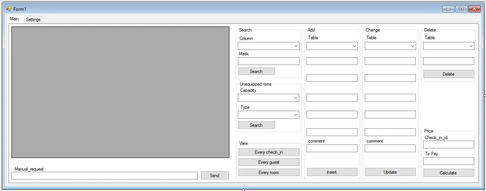
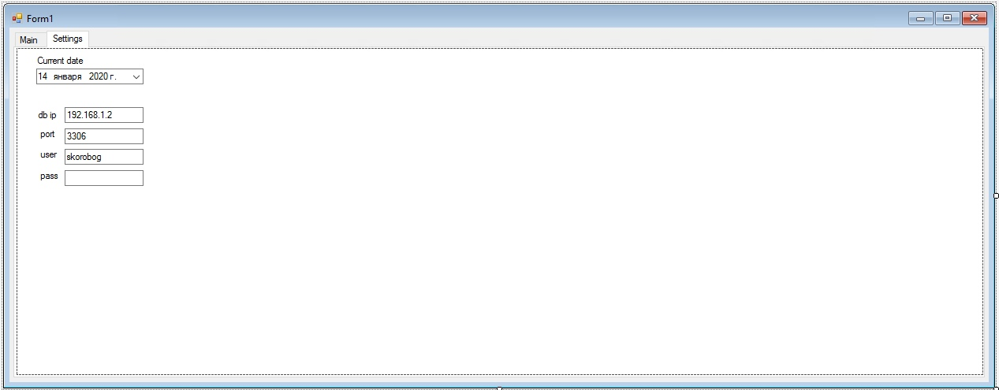

# Hotel reception desk application





Application is designed to work with MySQL DB, containing the following tables:
```
CREATE TABLE guest(
    passport_id DECIMAL(10, 0) PRIMARY KEY,
    last_name VARCHAR(20) NOT NULL,
    first_name VARCHAR(20) NOT NULL,
    middle_name VARCHAR(20),
    birth_date DATE,
    comment VARCHAR(100)
);
```

```
CREATE TABLE room(
    room_number INT PRIMARY KEY,
    capacity INT DEFAULT 2,
    type VARCHAR(10) DEFAULT 'standart',
    price INT NOT NULL,
    status VARCHAR(15) DEFAULT 'free'
);
```

```
CREATE TABLE check_in(
    check_in_id INT AUTO_INCREMENT PRIMARY KEY,
    guest_id DECIMAL(10, 0),
    room_id int,
    date_in DATE,
    date_out DATE,
    comment VARCHAR(100),
    FOREIGN KEY (guest_id) REFERENCES guest(passport_id) ON DELETE SET NULL,
    FOREIGN KEY (room_id) REFERENCES room(room_number) ON DELETE SET NULL
);
```
